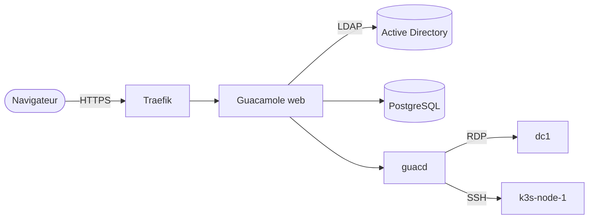

# Ansible - Cluster K3s + Longhorn + KubeVirt

## 📁 Structure du projet

```
ansible/
├── ansible.cfg                    # Configuration Ansible
├── requirements.yml               # Collections Galaxy
├── site.yml                       # Playbook principal
├── inventory/
│   └── hosts.yml                  # Inventaire + variables disques
├── group_vars/
│   └── k3s_cluster.yml            # Variables globales cluster
├── host_vars/                     # Variables spécifiques par nœud
│   ├── k3s-node-1.yml             # (à créer si différences)
│   ├── k3s-node-2.yml
│   └── k3s-node-3.yml
├── playbooks/                     # Un playbook par brique (voir playbooks/README.md)
│   ├── prerequisites.yml          # Git + packages + système
│   ├── lvm.yml                    # Configuration LVM 3 tiers
│   ├── k3s.yml                    # Installation K3s HA
│   ├── longhorn.yml               # Installation Longhorn
│   ├── metallb.yml                # MetalLB
│   ├── traefik.yml                # Traefik Ingress
│   ├── monitoring.yml             # Prometheus/Grafana
│   ├── pushgateway.yml            # Pushgateway + dashboard benchmark Wi-Fi (kwaba-wifi)
│   ├── collectd-exporter.yml      # collectd_exporter + dashboard métriques des bornes (kwaba-wifi)
│   ├── sftpgo.yml                 # SFTPGo : sauvegardes des bornes (kwaba-wifi), partage NAS « sftp »
│   ├── guacamole.yml              # Apache Guacamole : bastion HTTPS SSH/RDP (voir guacamole/README.md)
│   ├── prestashop.yml             # PrestaShop : boutique Barista (voir charts/prestashop/README.md)
│   ├── ...                        # nextcloud, paheko, mobilizon, nas, letsencrypt, etc.
│   ├── kubevirt.yml               # KubeVirt (à venir)
│   └── rancher.yml                # Rancher UI (à venir)
├── guacamole/                     # Manifests Kubernetes de Guacamole + README
├── charts/                        # Charts Helm locaux (sftpgo, ...)
└── roles/                         # Roles réutilisables (à venir)
    ├── common/
    ├── lvm/
    ├── k3s/
    └── longhorn/
```

| Documentation | Contenu |
|---|---|
| [`playbooks/README.md`](playbooks/README.md) | Liste des playbooks, ordre de déploiement, comment les lancer |
| [`guacamole/README.md`](guacamole/README.md) | Bastion Guacamole : architecture, fonctionnement, déploiement, dépannage |
| [`charts/prestashop/README.md`](charts/prestashop/README.md) | Boutique PrestaShop : architecture, démarrage, réparation, dépannage |

---

## 🔐 Bastion Guacamole (SSH / RDP)

Accès HTTPS aux serveurs depuis un navigateur : `https://guacamole.app.xixtu.eu/`.
Authentification Active Directory + TOTP, transfert de fichiers, enregistrement et relecture
des sessions.



```bash
git pull
ansible-playbook playbooks/guacamole.yml -K --connection=local
```

Détails, schémas et dépannage : [`guacamole/README.md`](guacamole/README.md).

---

## 🚀 Démarrage rapide

### 1. Installer les collections Galaxy

```bash
cd ansible/
ansible-galaxy collection install -r playbooks/requirements.yml
```

### 2. Configurer les IPs dans l'inventaire

```bash
vi inventory/hosts.yml
# Mettre à jour les ansible_host avec les vraies IPs
```

### 3. Tester la connexion

```bash
ansible all -i inventory/hosts.yml -m ping -k -K
```

### 4. Lancer les prérequis

```bash
ansible-playbook site.yml --tags prereq -k 
```

### 5. Configurer le LVM

```bash
ansible-playbook site.yml --tags lvm -k
```

### 6. Tout déployer

```bash
ansible-playbook site.yml
```

---

## 🏗️ Architecture stockage

### 3 tiers Longhorn par nœud

| Tier | Devices | Taille | Mountpoint | Usage |
|------|---------|--------|------------|-------|
| **Ultra** | Samsung 860 Pro | 476 GB | /data_ultra | BDD critiques |
| **Fast** | 2x Samsung 870 (LVM) | 1.82 TB | /data_fast | Apps web |
| **Slow** | 2x Seagate HDD (LVM) | 7.28 TB | /data_slow | Archives |

### Storage Classes Longhorn

```yaml
longhorn-ultra  → /data_ultra  (SSD Pro)      ← latence minimale
longhorn-fast   → /data_fast   (SSD x2 LVM)   ← défaut
longhorn-slow   → /data_slow   (HDD x2 LVM)   ← archives/backups
```

---

## 📋 Tags disponibles

```bash
# Prérequis système + Git
ansible-playbook site.yml --tags prereq

# LVM seulement
ansible-playbook site.yml --tags lvm

# Tier ultra seulement
ansible-playbook site.yml --tags ultra

# Tier fast seulement
ansible-playbook site.yml --tags fast

# Tier slow seulement
ansible-playbook site.yml --tags slow

# Vérification seulement (dry-run)
ansible-playbook site.yml --tags verify --check

# Un seul nœud
ansible-playbook site.yml --limit k3s-node-1
```

---

## ⚠️ Points d'attention

### Avant de lancer LVM

1. **Vérifier les devices dans hosts.yml**
   - Les nœuds 2 et 3 peuvent avoir des devices différents !
   - Toujours vérifier avec `lsblk` avant de lancer

2. **Le LVM est DESTRUCTIF**
   - Il écrase les données existantes sur les disques
   - S'assurer que les disques sont vides ou les données sauvegardées

3. **Le disque OS ne doit PAS être dans le LVM**
   - Vérifier que `disk_os.device` est exclu des configs LVM

### Variables à adapter par nœud

Si les nœuds 2 et 3 ont des configurations différentes,
créer des fichiers `host_vars/k3s-node-X.yml` qui surchargeront
les variables de l'inventaire.

---

## 🔧 Commandes utiles

```bash
# Vérifier la syntaxe
ansible-playbook site.yml --syntax-check

# Mode dry-run (ne fait rien)
ansible-playbook site.yml --check --diff

# Afficher l'inventaire
ansible-inventory --list --yaml

# Afficher les variables d'un hôte
ansible-inventory --host k3s-node-1

# Vérifier la connectivité
ansible all -m ping -v

# Collecter les facts
ansible all -m setup | grep -i disk
```
