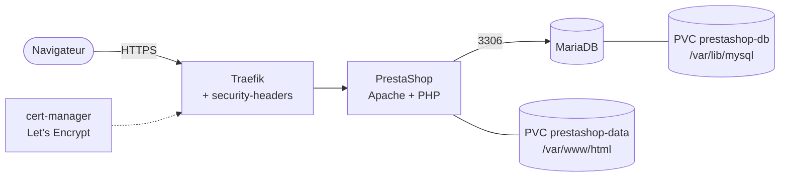
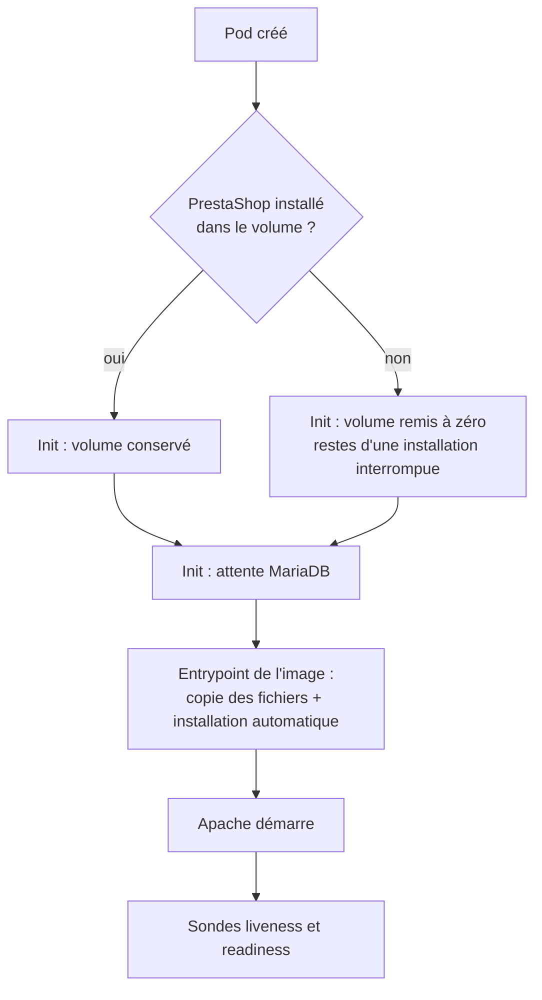

# PrestaShop - Boutique e-commerce (café capsules « Barista »)

- Boutique : `https://barista.app.xixtu.eu`
- Administration : `https://barista.app.xixtu.eu/admin-barista`
- Chart Helm local, déployé par `playbooks/prestashop.yml`
- Images officielles Docker Hub : `prestashop/prestashop:8.2.4` (version figée) et `mariadb:10.11`

## Architecture



Un seul pod PrestaShop et un seul pod MariaDB, chacun avec son volume Longhorn (RWO,
stratégie `Recreate`). Il n'y a pas de mise à l'échelle automatique : un volume RWO ne peut
pas être partagé entre plusieurs pods.

## Démarrage d'un pod PrestaShop



- Au **premier démarrage**, l'installation automatique prend 15 à 30 minutes. Pendant ce
  temps Apache n'écoute pas encore : la `startupProbe` laisse 30 minutes (120 x 15 s) avant
  de considérer le pod en échec, et les autres sondes n'agissent qu'après.
- La base est créée par MariaDB (`MYSQL_DATABASE`). L'image ne la crée pas
  (`PS_INSTALL_DB=0`) car l'utilisateur applicatif n'a pas le droit de créer une base.
- L'image sort avec le code **42** quand elle trouve un verrou d'installation périmé ou une
  installation partielle. L'init container `reset-if-not-installed` évite ce blocage en
  repartant d'un volume vide tant que PrestaShop n'est pas installé. Une fois installé, il ne
  touche plus à rien.

## Déploiement

```bash
cd ~/git/k3s-kubevirt
git pull
ansible-playbook playbooks/prestashop.yml -K --connection=local
```

Prérequis : k3s, Longhorn, MetalLB, Traefik (avec le middleware `security-headers`),
cert-manager, Helm, et le DNS `barista.app.xixtu.eu` vers l'IP publique de Traefik
(ports 80 et 443 ouverts pour le challenge HTTP-01).

| Tag | Effet |
|---|---|
| `prestashop-install` | Déploie le chart (namespace, Helm, certificat) |
| `prestashop-tls` | Force le renouvellement du certificat en ECDSA |
| `prestashop-verify` | Vérifie pods, services, Ingress, certificat, volumes |

Suivre l'installation :

```bash
kubectl -n prestashop get pods
kubectl -n prestashop logs -l app.kubernetes.io/component=app -f --all-containers
```

## Réparer un volume abîmé

Une ancienne version du chart supprimait au démarrage tous les fichiers dont le nom contient
`lock` (`find -name "*lock*" -delete`), ce qui détruisait aussi les fichiers `*Block*.php`
de PrestaShop (erreur 500 avec `Class ... not found`). Le chart actuel ne fait plus rien de tel.
Si un volume a été touché, on restaure les fichiers manquants depuis les sources de l'image,
sans rien écraser :

```bash
kubectl -n prestashop exec deploy/prestashop -c prestashop -- sh -c '
cd /tmp/data-ps/prestashop
find . -type f ! -path "./install/*" ! -path "./admin/*" | while IFS= read -r f; do
  [ -e "/var/www/html/$f" ] || echo "$f"
done > /tmp/missing.txt
wc -l /tmp/missing.txt
while IFS= read -r f; do cp -p --parents "$f" /var/www/html/; chown www-data:www-data "/var/www/html/$f"; done < /tmp/missing.txt
rm -rf /var/www/html/var/cache/*'
```

À faire avec la même version d'image que celle installée (`8.2.4`).

## Recommencer l'installation de zéro

Seulement si la boutique ne contient rien à garder. Cela supprime le code, les médias et la
base :

```bash
helm uninstall prestashop -n prestashop
kubectl -n prestashop delete pvc --all
ansible-playbook playbooks/prestashop.yml -K --connection=local
```

## Dépannage

| Symptôme | Cause et solution |
|---|---|
| Erreur 500 avec `Class ... not found` dans les logs | Fichiers manquants dans le volume : voir « Réparer un volume abîmé » |
| Pod `Running` mais `0/1` pendant longtemps | Installation en cours : attendre jusqu'à 30 min, suivre les logs |
| Pod redémarré en boucle avant la fin de l'installation | Mémoire insuffisante (OOM) : vérifier `kubectl -n prestashop describe pod`, augmenter la limite dans `values.yaml` |
| Liens ou images pointant vers un mauvais domaine | `PS_DOMAIN` est écrit en base à l'installation : corriger le domaine puis recommencer l'installation de zéro |
| Certificat absent | DNS ou port 80 non joignable pour le challenge HTTP-01 : `kubectl -n prestashop get certificate,challenge` |
