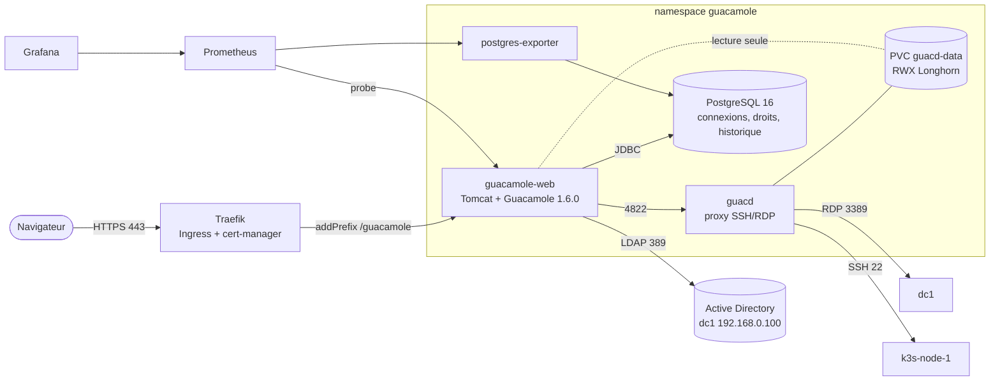
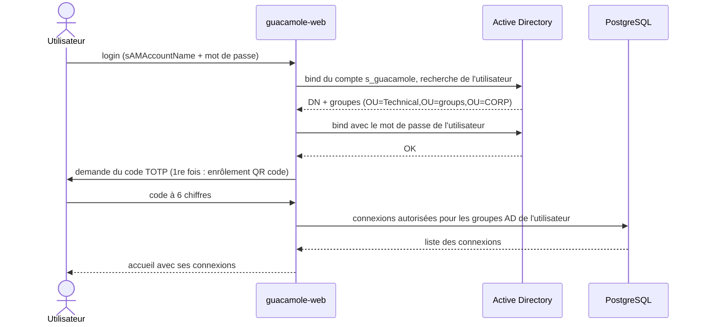
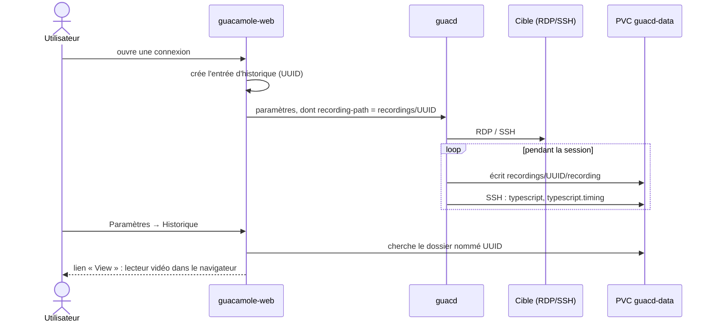
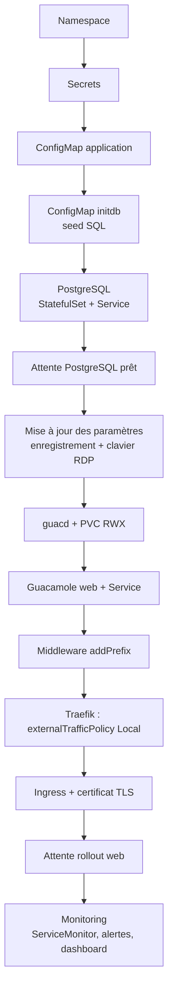

# Apache Guacamole - Bastion HTTPS (SSH / RDP)

Bastion web pour rebondir en **SSH** et **RDP** depuis un simple navigateur.
Authentification via **Active Directory** (LDAP) + **TOTP**, transfert de fichiers,
enregistrement des sessions avec relecture dans l'interface.

- URL : `https://guacamole.app.xixtu.eu/`
- Version : Apache Guacamole **1.6.0**
- Déploiement : manifests Kubernetes bruts (pas de Helm), lancés par `playbooks/guacamole.yml`
- Pas de rôle Ansible : le playbook applique directement les manifests de ce dossier

---

## Fonctionnalités

| Fonction | Détail |
|---|---|
| Authentification | Active Directory `corp.lcl` (LDAP, DC `192.168.0.100`) + TOTP (2e facteur) |
| Cibles | `dc1` (RDP, 192.168.0.100) et `k3s-node-1` (SSH, 192.168.0.11) |
| Droits | Par groupe AD : `GRP_Guac_Admins`, `GRP_Guac_DC1`, `GRP_Guac_K3S1` |
| Transfert de fichiers | SSH : SFTP direct. RDP : lecteur redirigé (`\\tsclient\Guacamole`) |
| Presse-papier / impression | Presse-papier normalisé Windows, impression PDF |
| Enregistrement | Vidéo des sessions (SSH + RDP) rejouable dans Paramètres → Historique ; typescript texte en plus pour SSH |
| Clavier RDP | `fr-fr-azerty` |
| Supervision | postgres-exporter, sonde blackbox, alertes Prometheus, dashboard Grafana |

---

## Architecture



### Composants

| Fichier | Rôle |
|---|---|
| `namespace.yaml` | Namespace `guacamole` |
| `secrets.yaml` | Mots de passe base de données et compte LDAP (committés volontairement) |
| `configmap.yaml` | Configuration de l'application (variables d'environnement) |
| `postgresql/` | StatefulSet PostgreSQL + service, avec sidecar postgres-exporter |
| `initdb/seed-connections.sql` | Connexions, groupes AD et permissions créés à l'initialisation de la base |
| `guacd/` | Daemon proxy + PVC partagé `guacd-data` |
| `web/` | Application web, service, ingress et middleware Traefik |
| `monitoring/` | ServiceMonitor, alertes, sonde blackbox, dashboard Grafana |
| `scripts/ad-prerequisites.ps1` | Création du compte de service et des groupes dans l'AD |

---

## Comment ça marche

### Connexion et droits



L'utilisateur n'est pas créé à la main : un compte AD membre d'un groupe `GRP_Guac_*` obtient
automatiquement les droits décrits dans `seed-connections.sql`.

### Session et enregistrement



Points importants :

- L'historique retrouve un enregistrement **par l'UUID de la session**. Les connexions
  utilisent donc `recording-path = ${HISTORY_PATH}/${HISTORY_UUID}`. Un autre nommage rend
  la vidéo invisible dans l'interface.
- L'extension de lecture est déjà dans l'image. Elle est activée par `RECORDING_ENABLED=true`.
- guacd écrit avec les droits `750/640` du groupe `guacd` (gid 1000). Le pod web a donc
  `supplementalGroups: [1000]` pour pouvoir lire les fichiers.
- Le volume `guacd-data` est en **ReadWriteMany** : guacd écrit, le web lit. Longhorn crée
  un pod `share-manager` qui exporte le volume en NFS. Un volume RWO ne peut pas être monté
  dans deux pods, même sur le même nœud.

### Transfert de fichiers

- **SSH** : le panneau de transfert de la barre latérale (Ctrl+Alt+Maj) envoie et récupère les
  fichiers en SFTP sur la cible.
- **RDP** : Guacamole expose le dossier `/var/lib/guacamole/drive` de guacd comme un lecteur
  Windows. Il apparaît dans l'explorateur sous `\\tsclient\Guacamole`.
  Les messages `File open refused (-2)` sur des fichiers `:Zone.Identifier` dans les logs de
  guacd sont normaux (flux NTFS non supportés sous Linux).

### IP réelle du client

Sans réglage, l'historique affiche l'IP du pod Traefik. Deux réglages la restaurent :

- `REMOTE_IP_VALVE_ENABLED=true` : Tomcat lit l'en-tête `X-Forwarded-For`.
- Service Traefik en `externalTrafficPolicy: Local` : kube-proxy ne masque plus l'IP source.

### URL sans `/guacamole/`

Tomcat sert l'application sous `/guacamole/`. Le middleware Traefik `addPrefix` réécrit
`/` en `/guacamole/`, ce qui permet d'ouvrir simplement `https://guacamole.app.xixtu.eu/`.

---

## Déploiement

### Prérequis

1. **Active Directory** : exécuter `scripts/ad-prerequisites.ps1` sur le contrôleur de domaine.
   Il crée le compte `s_guacamole` et les trois groupes `GRP_Guac_*`.
2. **DNS** : `guacamole.app.xixtu.eu` doit pointer vers l'IP publique qui arrive sur Traefik.
3. **Cluster** : k3s, Longhorn (classe `longhorn-fast`), MetalLB, Traefik, cert-manager
   (`letsencrypt-production`) et la stack de monitoring doivent être déployés.
4. Paquet `nfs-common` sur le nœud (nécessaire au volume RWX Longhorn).

### Lancer le déploiement

Depuis le nœud `k3s-node-1` (pas de SSH nécessaire) :

```bash
cd ~/git/k3s-kubevirt
git pull
ansible-playbook playbooks/guacamole.yml -K --connection=local
```

Depuis un autre poste, sans `--connection=local`, avec l'inventaire habituel.

### Tags

| Tag | Effet |
|---|---|
| `deploy` | Application complète (namespace, secrets, base, guacd, web, ingress) |
| `monitoring` | ServiceMonitor, alertes et dashboard Grafana |
| `status` | Affiche l'état des pods, services et ingress |
| `restart` | Redémarre le pod web, à utiliser après un changement de `configmap.yaml` (jamais lancé par défaut) |

```bash
ansible-playbook playbooks/guacamole.yml -K --connection=local --tags monitoring
ansible-playbook playbooks/guacamole.yml -K --connection=local --tags restart
```

### Ordre d'exécution du playbook



La mise à jour des paramètres (étape G) peut être relancée sans risque. Elle aligne une base
déjà initialisée sur `seed-connections.sql`, qui n'est exécuté qu'à la première création.

### Vérifier

```bash
kubectl -n guacamole get pods,pvc,ingress
kubectl -n guacamole exec deploy/guacamole-web -- env | grep -E 'RECORDING|REMOTE'
kubectl -n guacamole exec deploy/guacamole-web -- ls /var/lib/guacamole/recordings
```

Tous les pods doivent être `Running`, le PVC `guacd-data` en `RWX` et `Bound`.

### Reconstruire de zéro

```bash
kubectl delete namespace guacamole
kubectl get pvc -A | grep guacamole        # doit être vide
ansible-playbook playbooks/guacamole.yml -K --connection=local
```

---

## Administration

- Les administrateurs sont les membres de `GRP_Guac_Admins` (Paramètres : utilisateurs,
  connexions, historique, sessions actives).
- Ajouter une cible : Paramètres → Connexions, puis donner l'accès au groupe AD voulu.
  Pour que la nouvelle connexion soit enregistrée et rejouable, reprendre les paramètres
  `recording-*` d'une connexion existante.
- Ajouter une cible dans le seed : modifier `initdb/seed-connections.sql`. Il n'est joué
  qu'à la première initialisation de la base.

## Dépannage

| Symptôme | Cause et solution |
|---|---|
| Pod web bloqué en `ContainerCreating` | Volume RWX non monté : vérifier `kubectl -n longhorn-system get pods \| grep share-manager` et `nfs-common` sur le nœud |
| Pod ancien bloqué en `Terminating` | `kubectl -n guacamole delete pod <nom> --force --grace-period=0` |
| Namespace bloqué en `Terminating` | Retirer les finalizers : `kubectl get ns guacamole -o json \| jq '.spec.finalizers=[]' \| kubectl replace --raw /api/v1/namespaces/guacamole/finalize -f -` |
| Colonne « Journaux » vide dans l'historique | Vérifier `RECORDING_ENABLED=true`, les chemins `${HISTORY_UUID}` en base et `id` dans le pod web (groupe 1000) |
| Clavier RDP en QWERTY | `server-layout` absent de la connexion : relancer le playbook (tag `deploy`) |
| IP client = `10.42.x.x` | `REMOTE_IP_VALVE_ENABLED` absent, ou service Traefik pas en `externalTrafficPolicy: Local` |
| Un champ supprimé d'un manifest reste dans le cluster | `kubectl apply` ne retire rien sur un objet créé par Ansible : supprimer le champ avec `kubectl patch` ou recréer l'objet |
| Un changement de ConfigMap n'est pas pris en compte | Les variables sont lues au démarrage : `--tags restart` |

## Supervision

- `monitoring/servicemonitor.yaml` : métriques PostgreSQL, sonde HTTP du service web, alertes
  (web down, PostgreSQL down, connexions élevées, redémarrages en boucle).
- `monitoring/grafana-dashboard.json` : dashboard « Apache Guacamole - Bastion », chargé par
  le playbook dans le namespace `monitoring`.
