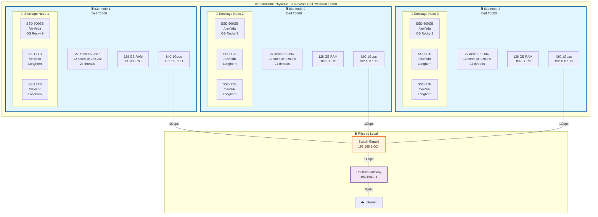
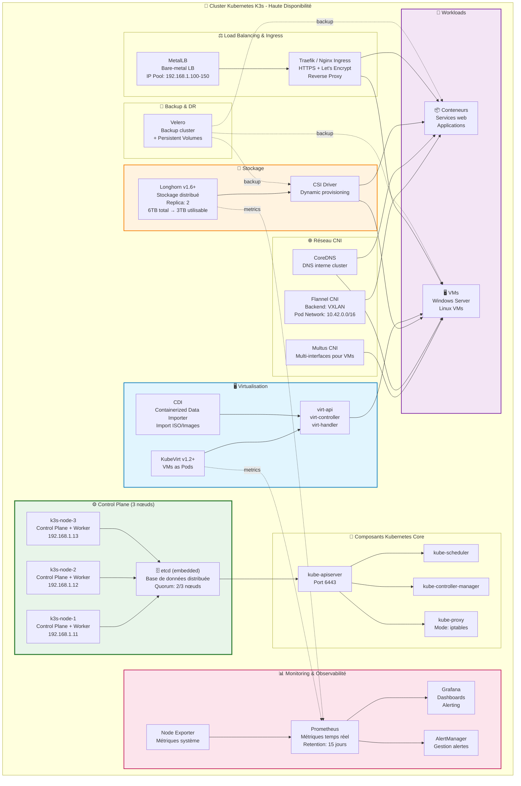
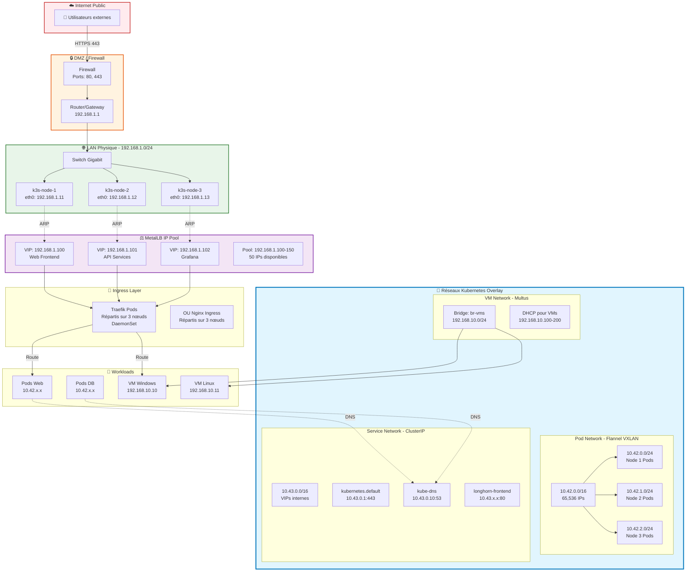
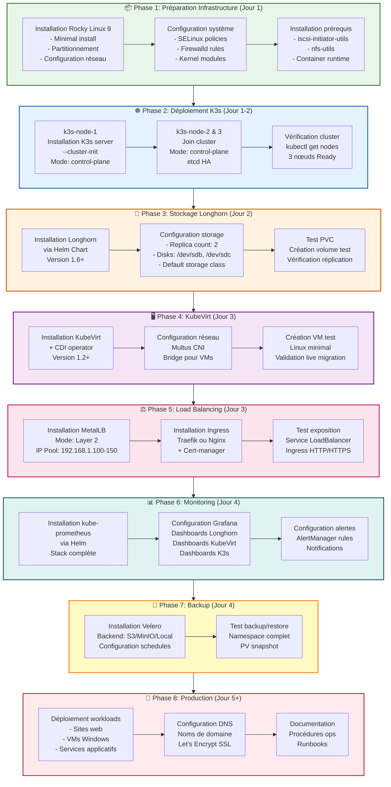
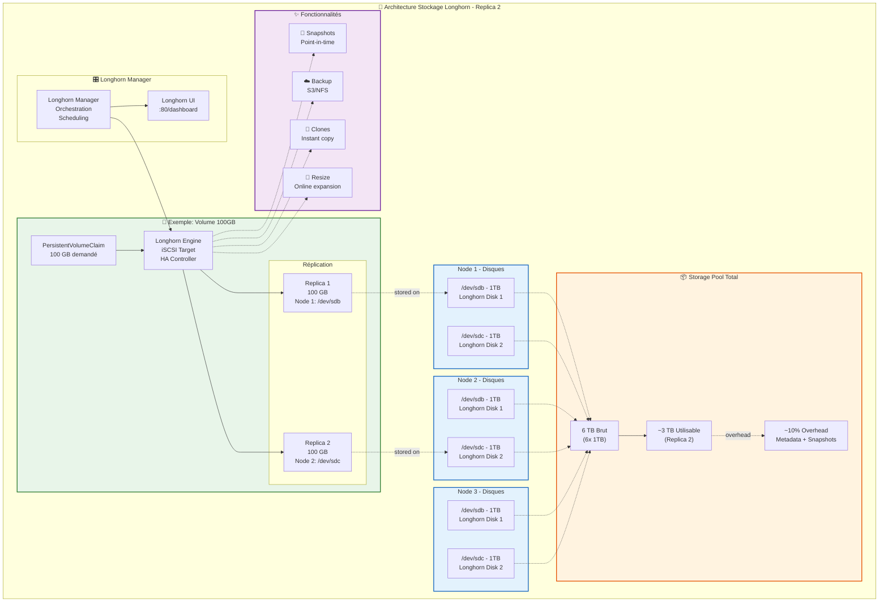
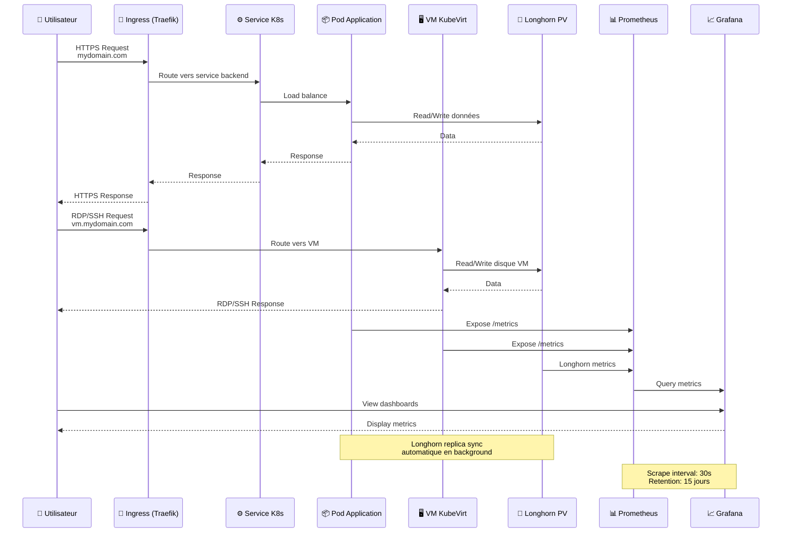
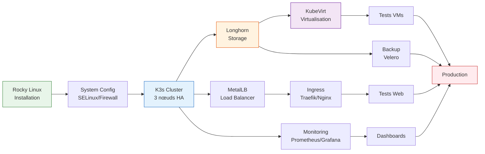

# Architecture Cluster K3s + KubeVirt + Longhorn
## Infrastructure Haute Disponibilité sur Rocky Linux 9

---

## 📋 Table des matières

1. [Vue d'ensemble](#vue-densemble)
2. [Schéma d'infrastructure physique](#schéma-dinfrastructure-physique)
3. [Schéma logique des composants](#schéma-logique-des-composants)
4. [Architecture réseau](#architecture-réseau)
5. [Schéma de déploiement](#schéma-de-déploiement)
6. [Stockage Longhorn](#stockage-longhorn)
7. [Flux de données](#flux-de-données)
8. [Plan de déploiement](#plan-de-déploiement)

---

## Vue d'ensemble

### Objectifs du cluster

- **Hébergement mixte** : VMs (Windows/Linux) + Conteneurs
- **Haute disponibilité** : 3 nœuds avec réplication
- **Monitoring** : Prometheus + Grafana
- **Production légère** : Sites web, services internes
- **Lab/Développement** : CI/CD, tests
- **Budget zéro** : 100% open-source gratuit

### Spécifications matérielles

| Composant | Spécification |
|-----------|---------------|
| **Serveurs** | 3x Dell Precision T5600 |
| **CPU** | 2x Xeon 6 cœurs (12 cores/serveur) |
| **RAM** | 128 GB par serveur (384 GB total) |
| **Stockage OS** | 1x SSD 500 GB par serveur |
| **Stockage Data** | 2x SSD 1 TB par serveur (6 TB total) |
| **Extension future** | 2x HDD 3.5" par serveur (optionnel) |

---

## Schéma d'infrastructure physique



---

## Schéma logique des composants



---

## Architecture réseau



### Tableau récapitulatif réseau

| Réseau | CIDR | Usage | Type |
|--------|------|-------|------|
| **LAN Physique** | 192.168.1.0/24 | Nœuds K3s, management | Physique |
| **Pod Network** | 10.42.0.0/16 | Conteneurs Kubernetes | Overlay (Flannel VXLAN) |
| **Service Network** | 10.43.0.0/16 | ClusterIP services | Virtuel (iptables) |
| **VM Network** | 192.168.10.0/24 | VMs KubeVirt | Bridge (Multus) |
| **MetalLB Pool** | 192.168.1.100-150 | LoadBalancer IPs | Physique (ARP) |

### Ports importants

| Service | Port | Protocole | Description |
|---------|------|-----------|-------------|
| **K3s API** | 6443 | TCP | Kubernetes API Server |
| **etcd** | 2379-2380 | TCP | Base de données cluster |
| **Kubelet** | 10250 | TCP | Node management |
| **Flannel VXLAN** | 8472 | UDP | Overlay network |
| **Longhorn** | 9500-9504 | TCP | Storage management |
| **HTTP** | 80 | TCP | Ingress web |
| **HTTPS** | 443 | TCP | Ingress web sécurisé |
| **Grafana** | 3000 | TCP | Monitoring UI |
| **Prometheus** | 9090 | TCP | Metrics |

---

## Schéma de déploiement



---

## Stockage Longhorn



### Calcul capacité Longhorn

```
Capacité brute totale     : 6 TB (6 disques × 1 TB)
Réplication (replica 2)   : ÷ 2
Capacité nette théorique  : 3 TB
Overhead Longhorn (~10%)  : - 300 GB
═══════════════════════════════════════════════
Capacité utilisable       : ~2.7 TB
```

### Stratégie de réplication

| Type de données | Replica Count | Justification |
|-----------------|---------------|---------------|
| **VMs critiques** | 2 | Production, HA |
| **Bases de données** | 2 | Données importantes |
| **Sites web statiques** | 2 | Disponibilité |
| **Cache/Temp** | 1 | Données volatiles |
| **Logs** | 1 | Peut être recréé |

---

## Flux de données



---

## Plan de déploiement détaillé

### Timeline estimée

| Phase | Durée | Dépendances |
|-------|-------|-------------|
| **Phase 1** : Préparation infra | 4-6h | - |
| **Phase 2** : K3s cluster | 2-3h | Phase 1 |
| **Phase 3** : Longhorn | 2-3h | Phase 2 |
| **Phase 4** : KubeVirt | 3-4h | Phase 3 |
| **Phase 5** : Load Balancing | 2-3h | Phase 2 |
| **Phase 6** : Monitoring | 2-3h | Phase 2 |
| **Phase 7** : Backup | 1-2h | Phase 3 |
| **Phase 8** : Production | Variable | Toutes |
| **TOTAL** | **~2-4 jours** | - |

### Ordre de déploiement recommandé



---

## Checklist de déploiement

### ✅ Pré-requis

- [ ] 3 serveurs Dell T5600 opérationnels
- [ ] Réseau configuré (192.168.1.0/24)
- [ ] Accès Internet depuis les serveurs
- [ ] ISO Rocky Linux 9 téléchargé
- [ ] Clés SSH générées
- [ ] Noms de domaine (optionnel)

### ✅ Phase 1 : OS

- [ ] Rocky Linux 9 installé sur les 3 nœuds
- [ ] Partitionnement correct (/dev/sda pour OS, /dev/sdb+sdc libres)
- [ ] Réseau configuré (IPs statiques)
- [ ] SELinux en mode Enforcing
- [ ] Firewalld configuré
- [ ] Modules kernel chargés (kvm, vhost_net)
- [ ] SSH fonctionnel
- [ ] Mise à jour système (`dnf update`)

### ✅ Phase 2 : K3s

- [ ] k3s-node-1 : server installé avec --cluster-init
- [ ] k3s-node-2 & 3 : joined au cluster
- [ ] `kubectl get nodes` : 3 nœuds Ready
- [ ] etcd quorum OK (2/3 minimum)
- [ ] CoreDNS fonctionnel
- [ ] Kubeconfig exporté

### ✅ Phase 3 : Longhorn

- [ ] Longhorn déployé via Helm
- [ ] UI accessible
- [ ] 6 disques détectés (2 par nœud)
- [ ] Storage class créée et default
- [ ] Test PVC créé et bound
- [ ] Réplication à 2 vérifiée

### ✅ Phase 4 : KubeVirt

- [ ] KubeVirt operator installé
- [ ] CDI operator installé
- [ ] VM Linux test créée
- [ ] VM démarrée et accessible
- [ ] Live migration testée
- [ ] Multus CNI configuré

### ✅ Phase 5 : Load Balancing

- [ ] MetalLB installé
- [ ] IP Pool configuré (192.168.1.100-150)
- [ ] Ingress controller installé
- [ ] Cert-manager installé
- [ ] Test service LoadBalancer OK
- [ ] Test Ingress HTTP/HTTPS OK

### ✅ Phase 6 : Monitoring

- [ ] kube-prometheus-stack installé
- [ ] Prometheus scraping OK
- [ ] Grafana accessible
- [ ] Dashboards importés
- [ ] Alertes configurées
- [ ] Node exporter sur tous les nœuds

### ✅ Phase 7 : Backup

- [ ] Velero installé
- [ ] Backend storage configuré
- [ ] Schedule backup créé
- [ ] Test restore OK

### ✅ Phase 8 : Production

- [ ] Workloads déployés
- [ ] DNS configuré
- [ ] SSL certificates OK
- [ ] Documentation à jour
- [ ] Monitoring actif
- [ ] Backup automatique

---

## Ressources et commandes utiles

### Vérification santé cluster

```bash
# Statut nœuds
kubectl get nodes -o wide

# Statut pods système
kubectl get pods -n kube-system

# Statut Longhorn
kubectl get pods -n longhorn-system

# Statut KubeVirt
kubectl get pods -n kubevirt

# Métriques nœuds
kubectl top nodes

# Métriques pods
kubectl top pods -A
```

### Accès aux UIs

```bash
# Longhorn UI
kubectl port-forward -n longhorn-system svc/longhorn-frontend 8080:80

# Grafana
kubectl port-forward -n monitoring svc/kube-prometheus-stack-grafana 3000:80

# Prometheus
kubectl port-forward -n monitoring svc/kube-prometheus-stack-prometheus 9090:9090
```

---

## Dimensionnement prévisionnel

### Répartition RAM (par nœud - 128GB)

| Composant | RAM allouée | Nombre | Total |
|-----------|-------------|--------|-------|
| **OS Rocky** | 2 GB | 1 | 2 GB |
| **K3s control plane** | 1.5 GB | 1 | 1.5 GB |
| **Longhorn** | 4 GB | 1 | 4 GB |
| **KubeVirt** | 2 GB | 1 | 2 GB |
| **Monitoring** | 4 GB | 1 | 4 GB |
| **System reserve** | 2 GB | 1 | 2 GB |
| **═════════════** | **═══** | **═** | **═════** |
| **Subtotal système** | - | - | **15.5 GB** |
| **Disponible workloads** | - | - | **~112 GB** |

### Workloads par nœud (estimation)

- **VMs moyennes** (8GB RAM) : 14 VMs par nœud → **42 VMs total**
- **Conteneurs** : Variable, ~50-100 pods légers par nœud
- **Mix réaliste** : 10 VMs + 30 conteneurs par nœud

---

## Évolution future

### Extensions possibles

1. **Stockage supplémentaire**
   - Ajout 2x HDD 3.5" par serveur
   - Tier de stockage "slow" pour archives
   - Longhorn : separate storage class

2. **Scaling horizontal**
   - Ajout de 1-2 worker nodes
   - Plus de capacité compute/storage

3. **GitOps**
   - ArgoCD pour déploiements
   - FluxCD alternative
   - Git as source of truth

4. **Service Mesh**
   - Istio ou Linkerd
   - Observabilité avancée
   - Traffic management

5. **CI/CD**
   - Jenkins ou Tekton
   - GitLab Runner
   - Pipeline automatisé

---

## Conclusion

Cette architecture offre :

✅ **Haute disponibilité** : 3 nœuds, quorum 2/3  
✅ **Flexibilité** : VMs + Conteneurs sur même plateforme  
✅ **Résilience** : Réplication stockage, no single point of failure  
✅ **Observabilité** : Monitoring complet Prometheus/Grafana  
✅ **Évolutivité** : Ajout de nœuds/stockage facile  
✅ **Coût zéro** : 100% open-source gratuit  
✅ **Production-ready** : Stack éprouvée en entreprise  

**Prêt pour la production légère et le lab/développement !**

---

**Version** : 1.0  
**Date** : Février 2026  
**Auteur** : Architecture K3s Cluster  
**Licence** : Documentation libre
