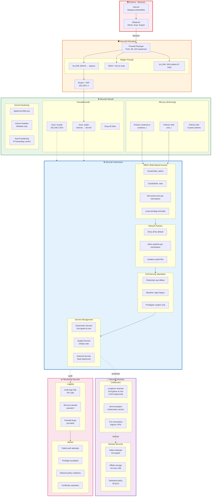
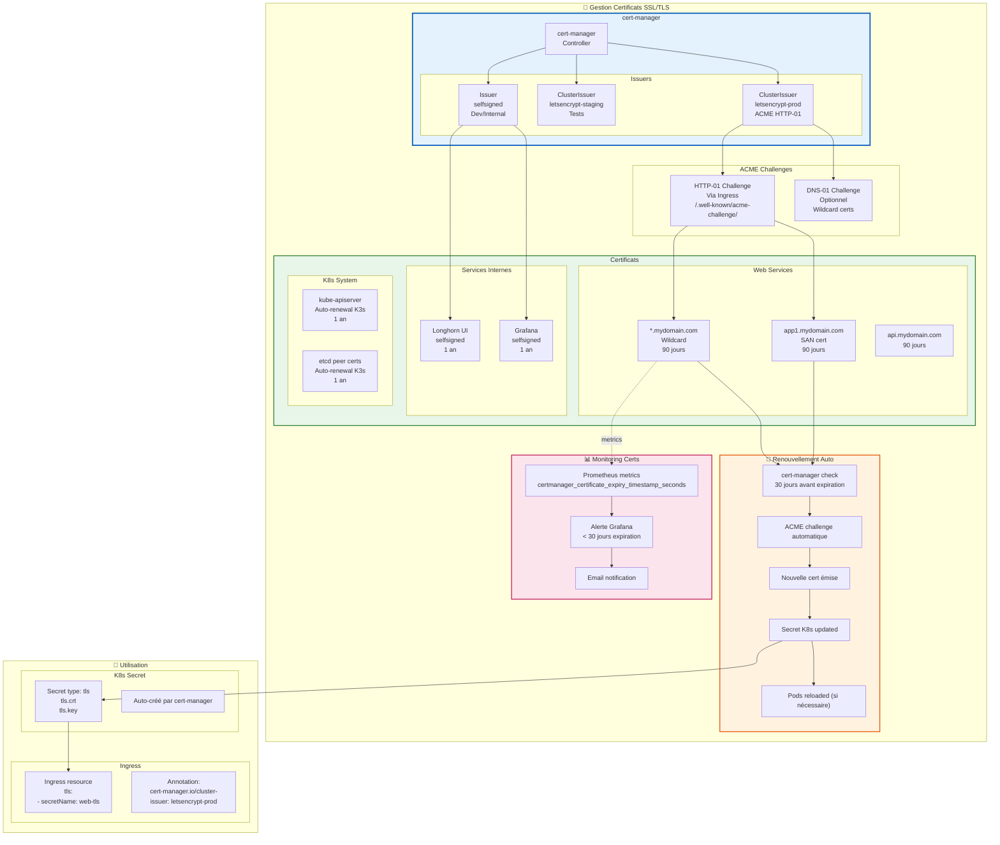
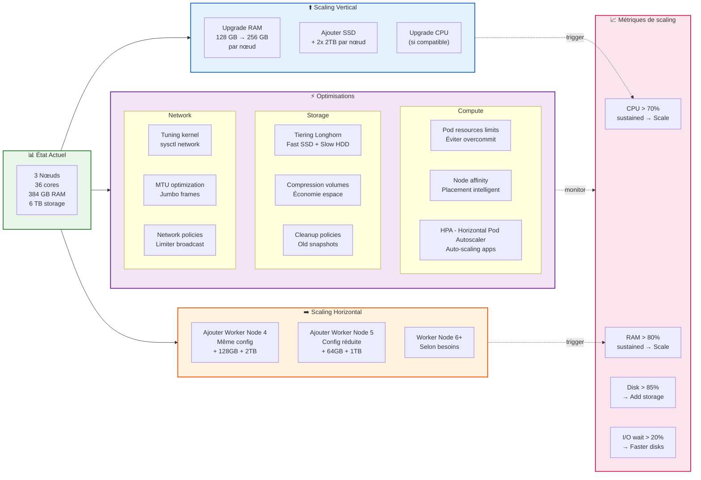

# Architecture Complémentaire - Sécurité, Backup & Troubleshooting

---

## Table des matières

1. [Architecture de sécurité](#architecture-de-sécurité)
2. [Flux de backup et disaster recovery](#flux-de-backup-et-disaster-recovery)
3. [Gestion des certificats SSL](#gestion-des-certificats-ssl)
4. [Haute disponibilité et failover](#haute-disponibilité-et-failover)
5. [Troubleshooting guide](#troubleshooting-guide)
6. [Scaling et optimisation](#scaling-et-optimisation)

---

## Architecture de sécurité



### Matrice de sécurité

| Couche | Mécanisme | Configuration | Impact |
|--------|-----------|---------------|--------|
| **Périmètre** | Firewall | Ports 80,443 only | 🔴 Critique |
| **Réseau** | Network Policies | Deny all default | 🔴 Critique |
| **Nœud** | SELinux | Enforcing | 🔴 Critique |
| **Nœud** | Firewalld | Trusted zone | 🟡 Important |
| **K8s** | RBAC | Least privilege | 🔴 Critique |
| **K8s** | Pod Security | Restricted default | 🟡 Important |
| **Données** | etcd encryption | AES-256 | 🟡 Important |
| **Données** | TLS | Let's Encrypt | 🔴 Critique |
| **Données** | Volume encryption | LUKS (optionnel) | 🟢 Bonus |

### Commandes de vérification sécurité

```bash
# Vérifier SELinux
getenforce  # Doit être "Enforcing"
ausearch -m avc -ts recent  # Denials récents

# Vérifier firewalld
firewall-cmd --list-all
firewall-cmd --get-active-zones

# Vérifier RBAC K8s
kubectl auth can-i --list --as=system:serviceaccount:default:default

# Vérifier Network Policies
kubectl get networkpolicies -A

# Vérifier Pod Security
kubectl get psp  # Pod Security Policies
kubectl label namespace default pod-security.kubernetes.io/enforce=restricted

# Vérifier secrets encryption
kubectl get secrets -n kube-system
ETCDCTL_API=3 etcdctl get /registry/secrets/default/mysecret | hexdump -C

# Vérifier certificats
kubectl get certificates -A
openssl s_client -connect mydomain.com:443 -servername mydomain.com
```

---

## Flux de backup et disaster recovery

```mermaid
graph TB
    subgraph Production["🚀 Environnement Production"]
        
        subgraph Cluster["Cluster K3s"]
            NS1["Namespace: web<br/>Pods + PVCs"]
            NS2["Namespace: database<br/>StatefulSets + PVCs"]
            VM1["VMs Windows<br/>PVCs pour disques"]
        end
        
        subgraph LonghornData["Longhorn Volumes"]
            PV1["PV: web-data<br/>100 GB"]
            PV2["PV: db-data<br/>500 GB"]
            PV3["PV: vm-disk<br/>200 GB"]
        end
    end
    
    subgraph BackupStrategy["💾 Stratégie de Backup"]
        
        subgraph VeleroBackup["Velero Backups"]
            V1["Backup quotidien<br/>Full cluster<br/>3h du matin"]
            V2["Backup hebdo<br/>Full + Snapshots<br/>Dimanche"]
            V3["Backup avant changes<br/>Manuels"]
        end
        
        subgraph LonghornSnap["Longhorn Snapshots"]
            LS1["Snapshots auto<br/>Toutes les 6h<br/>Retention: 7 jours"]
            LS2["Snapshots manuels<br/>Avant updates"]
        end
        
        subgraph etcdBackup["etcd Backup"]
            EB1["Snapshot etcd<br/>K3s automatique<br/>Toutes les 12h"]
            EB2["Retention: 5 snapshots"]
        end
    end
    
    subgraph Storage["🗄️ Stockage Backups"]
        
        subgraph Local["Local (temporaire)"]
            LocalPV["PV local<br/>500 GB<br/>Rétention: 7 jours"]
        end
        
        subgraph Remote["Remote (long-terme)"]
            S3["S3-compatible<br/>MinIO / Backblaze<br/>Rétention: 30 jours"]
            NFS["NFS distant<br/>Optionnel<br/>Backup secondaire"]
        end
    end
    
    subgraph DRScenarios["🔥 Scénarios Disaster Recovery"]
        
        subgraph S1["Scénario 1: Pod/VM crashed"]
            DR1A["Detection: Liveness probe fail"]
            DR1B["K8s restart automatique"]
            DR1C["RTO: 1-2 minutes"]
        end
        
        subgraph S2["Scénario 2: Données corrompues"]
            DR2A["Restore depuis snapshot Longhorn"]
            DR2B["Attach snapshot à nouveau pod"]
            DR2C["RTO: 5-10 minutes"]
        end
        
        subgraph S3["Scénario 3: Namespace supprimé"]
            DR3A["Restore Velero backup"]
            DR3B["velero restore create"]
            DR3C["RTO: 15-30 minutes"]
        end
        
        subgraph S4["Scénario 4: Node failure"]
            DR4A["K8s reschedule pods automatique"]
            DR4B["Longhorn replica sur autre node"]
            DR4C["RTO: 2-5 minutes"]
        end
        
        subgraph S5["Scénario 5: Cluster complet down"]
            DR5A["Rebuild cluster K3s"]
            DR5B["Restore etcd + Velero full"]
            DR5C["RTO: 2-4 heures"]
        end
    end
    
    subgraph Testing["🧪 Tests DR"]
        T1["Test mensuel<br/>Restore namespace test"]
        T2["Test trimestriel<br/>Rebuild cluster complet"]
        T3["Documentation runbook"]
    end
    
    %% Flux backup
    NS1 --> V1
    NS2 --> V1
    VM1 --> V1
    
    PV1 --> LS1
    PV2 --> LS1
    PV3 --> LS1
    
    V1 --> LocalPV
    V2 --> S3
    LS1 --> S3
    EB1 --> LocalPV
    
    LocalPV -.->|replicate| S3
    S3 -.->|backup2| NFS
    
    %% Flux restore
    S3 -.->|restore| DR3A
    LS1 -.->|restore| DR2A
    
    DR1A --> DR1B --> DR1C
    DR2A --> DR2B --> DR2C
    DR3A --> DR3B --> DR3C
    DR4A --> DR4B --> DR4C
    DR5A --> DR5B --> DR5C
    
    style Production fill:#e8f5e9,stroke:#2e7d32,stroke-width:2px
    style BackupStrategy fill:#e3f2fd,stroke:#1565c0,stroke-width:2px
    style Storage fill:#fff3e0,stroke:#e65100,stroke-width:2px
    style DRScenarios fill:#ffebee,stroke:#c62828,stroke-width:3px
    style Testing fill:#f3e5f5,stroke:#6a1b9a,stroke-width:2px
```



### Matrice RTO/RPO

| Scénario | Probabilité | RTO | RPO | Automatique |
|----------|-------------|-----|-----|-------------|
| **Pod crash** | Élevée | 1-2 min | 0 | ✅ Oui |
| **Node failure** | Moyenne | 2-5 min | 0 | ✅ Oui |
| **Données corrompues** | Faible | 5-10 min | 6h | ⚠️ Manuel |
| **Namespace supprimé** | Très faible | 15-30 min | 24h | ⚠️ Manuel |
| **Cluster détruit** | Critique | 2-4h | 24h | ❌ Manuel |

### Commandes backup/restore

```bash
# === VELERO ===

# Backup manuel namespace
velero backup create web-backup --include-namespaces web

# Backup full cluster
velero backup create full-cluster-$(date +%Y%m%d)

# Lister backups
velero backup get

# Restore depuis backup
velero restore create --from-backup web-backup

# Restore avec namespace mapping
velero restore create --from-backup prod-backup \
  --namespace-mappings prod:prod-restore

# === LONGHORN ===

# Créer snapshot manuel
kubectl apply -f - <<EOF
apiVersion: longhorn.io/v1beta1
kind: VolumeSnapshot
metadata:
  name: pv-snapshot-$(date +%Y%m%d)
  namespace: longhorn-system
spec:
  volumeName: pvc-abc123
EOF

# Lister snapshots
kubectl get volumesnapshots -n longhorn-system

# Restore depuis snapshot (créer nouveau PVC)
kubectl apply -f pvc-from-snapshot.yaml

# === ETCD (K3s) ===

# Snapshot manuel etcd
k3s etcd-snapshot save --name manual-snapshot

# Lister snapshots etcd
k3s etcd-snapshot ls

# Restore etcd (DANGER - cluster downtime)
k3s server \
  --cluster-reset \
  --cluster-reset-restore-path=/var/lib/rancher/k3s/server/db/snapshots/manual-snapshot
```

### Procédure de restore complet

```bash
# === DISASTER RECOVERY COMPLET ===

# 1. Rebuild cluster K3s (si nécessaire)
# Sur node 1
curl -sfL https://get.k3s.io | sh -s - server --cluster-init

# Sur nodes 2 & 3
curl -sfL https://get.k3s.io | K3S_TOKEN=xxx sh -s - server \
  --server https://node1:6443

# 2. Réinstaller Longhorn
helm install longhorn longhorn/longhorn -n longhorn-system

# 3. Réinstaller Velero
velero install --provider aws --bucket k3s-backups \
  --secret-file ./credentials-velero

# 4. Restore depuis Velero
velero restore create full-restore --from-backup latest-full-backup

# 5. Vérifier
kubectl get pods -A
kubectl get pvc -A

# 6. Restore VMs KubeVirt
kubectl apply -f vm-manifests/
virtctl start windows-vm-1
```

---

## Gestion des certificats SSL



### Installation cert-manager

```bash
# Installer cert-manager
kubectl apply -f https://github.com/cert-manager/cert-manager/releases/download/v1.13.0/cert-manager.yaml

# Vérifier installation
kubectl get pods -n cert-manager

# Créer ClusterIssuer Let's Encrypt (Production)
kubectl apply -f - <<EOF
apiVersion: cert-manager.io/v1
kind: ClusterIssuer
metadata:
  name: letsencrypt-prod
spec:
  acme:
    server: https://acme-v02.api.letsencrypt.org/directory
    email: admin@mydomain.com
    privateKeySecretRef:
      name: letsencrypt-prod
    solvers:
    - http01:
        ingress:
          class: traefik
EOF

# Créer Ingress avec cert automatique
kubectl apply -f - <<EOF
apiVersion: networking.k8s.io/v1
kind: Ingress
metadata:
  name: web-ingress
  annotations:
    cert-manager.io/cluster-issuer: letsencrypt-prod
spec:
  tls:
  - hosts:
    - mydomain.com
    - www.mydomain.com
    secretName: mydomain-tls
  rules:
  - host: mydomain.com
    http:
      paths:
      - path: /
        pathType: Prefix
        backend:
          service:
            name: web-service
            port:
              number: 80
EOF

# Vérifier certificat
kubectl get certificate
kubectl describe certificate mydomain-tls
```

---

## Haute disponibilité et failover

```mermaid
graph TB
    subgraph NormalOps["✅ Opérations Normales - 3 Nœuds Actifs"]
        
        subgraph Node1Active["Node 1 - ACTIF"]
            N1CP["Control Plane<br/>✅ HEALTHY"]
            N1W["Worker<br/>20 Pods"]
            N1E["etcd member<br/>✅ HEALTHY"]
        end
        
        subgraph Node2Active["Node 2 - ACTIF"]
            N2CP["Control Plane<br/>✅ HEALTHY"]
            N2W["Worker<br/>18 Pods"]
            N2E["etcd member<br/>✅ HEALTHY"]
        end
        
        subgraph Node3Active["Node 3 - ACTIF"]
            N3CP["Control Plane<br/>✅ HEALTHY"]
            N3W["Worker<br/>22 Pods"]
            N3E["etcd member<br/>✅ HEALTHY"]
        end
        
        Quorum1["etcd Quorum<br/>3/3 membres<br/>✅ HEALTHY"]
        LB1["MetalLB<br/>3 speakers actifs<br/>ARP failover ready"]
    end
    
    subgraph Failure["❌ Scénario Panne - Node 2 DOWN"]
        
        subgraph Node1Failover["Node 1 - ACTIF"]
            N1CP2["Control Plane<br/>✅ HEALTHY"]
            N1W2["Worker<br/>29 Pods<br/>⬆️ +9 rescheduled"]
            N1E2["etcd member<br/>✅ HEALTHY"]
        end
        
        subgraph Node2Down["Node 2 - ⚠️ DOWN"]
            N2CP2["Control Plane<br/>❌ UNREACHABLE"]
            N2W2["Worker<br/>❌ NOT READY"]
            N2E2["etcd member<br/>❌ UNHEALTHY"]
        end
        
        subgraph Node3Failover["Node 3 - ACTIF"]
            N3CP2["Control Plane<br/>✅ HEALTHY"]
            N3W2["Worker<br/>31 Pods<br/>⬆️ +9 rescheduled"]
            N3E2["etcd member<br/>✅ HEALTHY"]
        end
        
        Quorum2["etcd Quorum<br/>2/3 membres<br/>⚠️ DEGRADED<br/>Toujours opérationnel"]
        LB2["MetalLB<br/>2 speakers actifs<br/>VIPs migrées"]
        
        subgraph FailoverActions["🔄 Actions Automatiques"]
            A1["T+0s: Node 2 unreachable"]
            A2["T+40s: kubelet heartbeat timeout"]
            A3["T+5min: Pods marked Terminating"]
            A4["T+6min: Pods reschedulés Node 1&3"]
            A5["T+8min: Longhorn replicas synced"]
            A6["T+10min: Service restored"]
        end
        
        A1 --> A2 --> A3 --> A4 --> A5 --> A6
    end
    
    subgraph Recovery["🔧 Récupération Node 2"]
        
        subgraph Node2Recovery["Node 2 - RECOVERY"]
            R1["Démarrage serveur"]
            R2["K3s rejoin cluster"]
            R3["etcd re-sync"]
            R4["Pods re-balance"]
        end
        
        R1 --> R2 --> R3 --> R4
        
        subgraph AfterRecovery["État après récupération"]
            Node1R["Node 1<br/>~20 Pods"]
            Node2R["Node 2<br/>~18 Pods"]
            Node3R["Node 3<br/>~22 Pods"]
            QuorumR["etcd 3/3<br/>✅ HEALTHY"]
        end
        
        R4 --> Node1R
        R4 --> Node2R
        R4 --> Node3R
        R3 --> QuorumR
    end
    
    subgraph CriticalFailure["🔥 Scénario Critique - 2 Nœuds DOWN"]
        
        CF1["Node 1: DOWN<br/>Node 2: DOWN<br/>Node 3: SEUL ACTIF"]
        CF2["etcd Quorum PERDU<br/>1/3 membres<br/>❌ CLUSTER READ-ONLY"]
        CF3["Pods existants: OK<br/>Nouveaux pods: IMPOSSIBLE"]
        CF4["API Server: READ-ONLY<br/>Aucune modification possible"]
        
        subgraph CFRecovery["Récupération manuelle requise"]
            CFR1["Option 1: Réparer 1 nœud<br/>→ Quorum 2/3 restauré"]
            CFR2["Option 2: etcd disaster recovery<br/>→ Rebuild depuis snapshot"]
        end
        
        CF1 --> CF2 --> CF3 --> CF4
        CF4 -.->|action| CFR1
        CF4 -.->|action| CFR2
    end
    
    N1E --> Quorum1
    N2E --> Quorum1
    N3E --> Quorum1
    
    N1E2 --> Quorum2
    N2E2 -.->|lost| Quorum2
    N3E2 --> Quorum2
    
    style NormalOps fill:#e8f5e9,stroke:#2e7d32,stroke-width:3px
    style Failure fill:#fff3e0,stroke:#e65100,stroke-width:3px
    style Recovery fill:#e3f2fd,stroke:#1565c0,stroke-width:2px
    style CriticalFailure fill:#ffebee,stroke:#c62828,stroke-width:3px
```



### Matrice de disponibilité

| Nœuds actifs | etcd Quorum | API Server | Workloads | Nouveaux déploiements | État |
|--------------|-------------|------------|-----------|----------------------|------|
| **3/3** | ✅ 3/3 | ✅ Write | ✅ Running | ✅ OK | 🟢 Optimal |
| **2/3** | ⚠️ 2/3 | ✅ Write | ✅ Running | ✅ OK | 🟡 Dégradé |
| **1/3** | ❌ 1/3 | ❌ Read-only | ✅ Running* | ❌ Bloqué | 🔴 Critique |

*Les pods existants continuent de tourner mais aucune modification n'est possible

### Temps de failover

```
Détection panne node     : 40 secondes (kubelet heartbeat)
Pods marqués Terminating : 5 minutes (grace period)
Reschedule pods          : 1-2 minutes
Longhorn replica sync    : 2-3 minutes
───────────────────────────────────────────────────
RTO total (failover auto): ~8-10 minutes
```

### Commandes diagnostic HA

```bash
# Vérifier état nœuds
kubectl get nodes
kubectl describe node k3s-node-2

# Vérifier etcd quorum
kubectl exec -n kube-system etcd-k3s-node-1 -- etcdctl member list
kubectl exec -n kube-system etcd-k3s-node-1 -- etcdctl endpoint health

# Vérifier répartition pods
kubectl get pods -A -o wide | grep node-2

# Simuler panne node (ATTENTION: test seulement)
kubectl drain k3s-node-2 --ignore-daemonsets --delete-emptydir-data

# Vérifier reschedule
watch kubectl get pods -A -o wide

# Récupérer node après test
kubectl uncordon k3s-node-2

# Forcer re-balance (optionnel)
kubectl rollout restart deployment/my-app
```

---

## Troubleshooting Guide

```mermaid
graph TB
    subgraph Issues["🐛 Problèmes Courants"]
        
        subgraph NodeIssues["Problèmes Nœuds"]
            NI1["Node NotReady"]
            NI2["High CPU/Memory"]
            NI3["Disk full"]
            NI4["Network issues"]
        end
        
        subgraph PodIssues["Problèmes Pods"]
            PI1["CrashLoopBackOff"]
            PI2["ImagePullBackOff"]
            PI3["Pending (no resources)"]
            PI4["Error/Failed"]
        end
        
        subgraph StorageIssues["Problèmes Stockage"]
            SI1["PVC Pending"]
            SI2["Longhorn degraded"]
            SI3["Slow I/O"]
            SI4["Volume mount failed"]
        end
        
        subgraph NetworkIssues["Problèmes Réseau"]
            NetI1["Service unreachable"]
            NetI2["Ingress 502/503"]
            NetI3["DNS resolution failed"]
            NetI4["Pod-to-pod timeout"]
        end
    end
    
    subgraph Diagnostic["🔍 Diagnostics"]
        
        subgraph NodeDiag["Diagnostic Nœuds"]
            ND1["kubectl get nodes<br/>kubectl describe node"]
            ND2["journalctl -u k3s<br/>systemctl status k3s"]
            ND3["df -h<br/>free -m<br/>top"]
            ND4["ping / traceroute<br/>firewall-cmd --list-all"]
        end
        
        subgraph PodDiag["Diagnostic Pods"]
            PD1["kubectl describe pod<br/>kubectl logs pod"]
            PD2["kubectl get events<br/>--sort-by='.lastTimestamp'"]
            PD3["kubectl exec -it pod -- sh<br/>Debug container"]
        end
        
        subgraph StorageDiag["Diagnostic Stockage"]
            SD1["kubectl get pvc -A<br/>kubectl describe pvc"]
            SD2["Longhorn UI<br/>Check replicas"]
            SD3["kubectl exec longhorn-manager -- longhorn-cli"]
        end
        
        subgraph NetworkDiag["Diagnostic Réseau"]
            ND["kubectl get svc,endpoints<br/>kubectl describe ingress"]
            ND5["kubectl run curl --rm -it --image=curlimages/curl -- sh"]
            ND6["kubectl exec coredns -- nslookup"]
        end
    end
    
    subgraph Solutions["✅ Solutions"]
        
        subgraph NodeSol["Solutions Nœuds"]
            NS1["Restart k3s:<br/>systemctl restart k3s"]
            NS2["Clean up:<br/>docker system prune"]
            NS3["Expand disk:<br/>Ajouter volume"]
            NS4["Fix firewall:<br/>firewall-cmd --add-port"]
        end
        
        subgraph PodSol["Solutions Pods"]
            PS1["Fix config:<br/>kubectl edit deployment"]
            PS2["Pull image manually:<br/>crictl pull image"]
            PS3["Scale cluster:<br/>Add node or resources"]
            PS4["Check logs:<br/>Fix application error"]
        end
        
        subgraph StorageSol["Solutions Stockage"]
            SS1["Manual provision:<br/>kubectl apply -f pvc.yaml"]
            SS2["Rebuild replica:<br/>Longhorn UI"]
            SS3["Tune Longhorn:<br/>CPU/Memory limits"]
            SS4["Check node affinity"]
        end
        
        subgraph NetworkSol["Solutions Réseau"]
            NtS1["Restart CoreDNS:<br/>kubectl rollout restart -n kube-system deployment/coredns"]
            NtS2["Check Ingress controller:<br/>kubectl logs ingress-controller"]
            NtS3["Verify NetworkPolicies"]
        end
    end
    
    NI1 --> ND1 --> NS1
    NI2 --> ND3 --> NS2
    NI3 --> ND3 --> NS3
    NI4 --> ND4 --> NS4
    
    PI1 --> PD1 --> PS4
    PI2 --> PD1 --> PS2
    PI3 --> PD2 --> PS3
    PI4 --> PD1 --> PS4
    
    SI1 --> SD1 --> SS1
    SI2 --> SD2 --> SS2
    SI3 --> SD3 --> SS3
    SI4 --> SD1 --> SS4
    
    NetI1 --> ND --> NtS2
    NetI2 --> ND --> NtS2
    NetI3 --> ND6 --> NtS1
    NetI4 --> ND5 --> NtS3
    
    style Issues fill:#ffebee,stroke:#c62828,stroke-width:2px
    style Diagnostic fill:#fff3e0,stroke:#e65100,stroke-width:2px
    style Solutions fill:#e8f5e9,stroke:#2e7d32,stroke-width:2px
```



### Commandes de troubleshooting essentielles

```bash
# ===== CLUSTER GLOBAL =====

# Vue d'ensemble cluster
kubectl cluster-info
kubectl get componentstatuses  # Deprecated mais utile

# Tous les événements récents
kubectl get events -A --sort-by='.lastTimestamp' | tail -50

# Top ressources
kubectl top nodes
kubectl top pods -A --sort-by=cpu
kubectl top pods -A --sort-by=memory

# ===== NŒUDS =====

# Statut détaillé nœud
kubectl describe node k3s-node-1
kubectl get node k3s-node-1 -o yaml

# Conditions nœud
kubectl get nodes -o custom-columns=NAME:.metadata.name,STATUS:.status.conditions[?(@.type=="Ready")].status

# Logs K3s
journalctl -u k3s -f
journalctl -u k3s --since "10 minutes ago"

# Ressources système
ssh node-1 'free -m; df -h; top -bn1 | head -20'

# ===== PODS =====

# Pods en erreur
kubectl get pods -A | grep -v Running | grep -v Completed

# Logs pod (toutes les replicas)
kubectl logs -l app=myapp --all-containers=true --tail=100

# Logs précédent crash
kubectl logs pod-name --previous

# Events pod spécifique
kubectl describe pod pod-name | grep -A 10 Events

# Debug interactif
kubectl run debug-pod --rm -it --image=nicolaka/netshoot -- bash

# ===== STOCKAGE =====

# PVCs en attente
kubectl get pvc -A | grep Pending

# Détails PVC
kubectl describe pvc my-pvc

# Longhorn volumes
kubectl get volumes -n longhorn-system
kubectl get replicas -n longhorn-system

# Vérifier attachement volumes
kubectl get volumeattachments

# ===== RÉSEAU =====

# Services et endpoints
kubectl get svc,endpoints -A

# Test DNS
kubectl run curl-test --rm -it --image=curlimages/curl -- sh
# Dans le pod:
nslookup kubernetes.default
nslookup my-service.my-namespace.svc.cluster.local

# Test connectivité inter-pods
kubectl exec -it pod-1 -- ping -c 3 10.42.1.5

# Ingress status
kubectl get ingress -A
kubectl describe ingress my-ingress

# NetworkPolicies
kubectl get networkpolicies -A

# ===== MONITORING =====

# Prometheus targets
kubectl port-forward -n monitoring svc/prometheus 9090:9090
# Ouvrir http://localhost:9090/targets

# Alertes actives
# Dans Prometheus UI: /alerts

# Logs Grafana
kubectl logs -n monitoring -l app.kubernetes.io/name=grafana

# ===== SÉCURITÉ =====

# Audit logs
journalctl -u k3s | grep audit

# SELinux denials (Rocky Linux)
ausearch -m avc -ts recent
sealert -a /var/log/audit/audit.log

# Permissions RBAC test
kubectl auth can-i create pods --as=system:serviceaccount:default:mysa
kubectl auth can-i --list --as=system:serviceaccount:default:mysa

# ===== BACKUP/RESTORE =====

# Velero status
velero backup get
velero restore get
velero backup describe my-backup

# Longhorn snapshots
kubectl get volumesnapshots -n longhorn-system

# etcd health
kubectl exec -n kube-system etcd-k3s-node-1 -- \
  etcdctl --endpoints=https://127.0.0.1:2379 \
  --cacert=/var/lib/rancher/k3s/server/tls/etcd/server-ca.crt \
  --cert=/var/lib/rancher/k3s/server/tls/etcd/server-client.crt \
  --key=/var/lib/rancher/k3s/server/tls/etcd/server-client.key \
  endpoint health

# ===== PERFORMANCE =====

# I/O disque
kubectl run fio --rm -it --image=nixery.dev/shell/fio -- \
  fio --name=test --size=1G --rw=randwrite --ioengine=libaio --direct=1

# Bande passante réseau
kubectl run iperf-server --image=networkstatic/iperf3 -- -s
kubectl run iperf-client --rm -it --image=networkstatic/iperf3 -- \
  -c iperf-server -t 30
```

### Checklist troubleshooting systématique

```
1. ❓ Quel est le symptôme exact ?
   - Service inaccessible ? Pod crash ? Lenteur ?

2. 🕐 Quand le problème a-t-il commencé ?
   - kubectl get events --sort-by='.lastTimestamp'
   - Corrélation avec un changement récent ?

3. 📊 Que disent les métriques ?
   - Grafana : CPU, RAM, Disk, Network
   - Prometheus : Alertes actives ?

4. 📝 Que disent les logs ?
   - Application logs
   - K3s logs (journalctl)
   - System logs (dmesg, /var/log/messages)

5. 🔍 État des composants liés ?
   - kubectl get pods -A | grep -i "error\|crash\|pending"
   - kubectl get nodes (tous Ready ?)
   - kubectl get pvc (tous Bound ?)

6. 🌐 Réseau OK ?
   - Ping inter-nœuds
   - DNS resolution (nslookup)
   - Firewall rules (firewall-cmd --list-all)

7. 💾 Stockage OK ?
   - df -h (espace disque)
   - Longhorn UI (replicas healthy ?)
   - I/O performance (iostat)

8. 🔒 Sécurité bloquante ?
   - SELinux denials (ausearch -m avc)
   - Firewall blocks
   - RBAC permissions

9. ⏪ Rollback possible ?
   - kubectl rollout undo deployment/app
   - Velero restore si nécessaire

10. 📞 Escalade ?
    - Documentation des symptômes
    - Logs complets
    - Timeline des événements
```

---

## Scaling et optimisation



### Seuils de scaling recommandés

| Métrique | Seuil Warning | Seuil Critical | Action |
|----------|---------------|----------------|--------|
| **CPU moyen** | > 60% | > 80% | Add node / Optimize |
| **RAM utilisée** | > 75% | > 85% | Add node / Add RAM |
| **Disk usage** | > 80% | > 90% | Add storage |
| **I/O wait** | > 15% | > 25% | Faster disks / Tune |
| **Network latency** | > 5ms | > 10ms | Check network |
| **Pod restarts** | > 5/hour | > 20/hour | Fix application |

### Commandes scaling

```bash
# === HORIZONTAL POD AUTOSCALER ===

# Créer HPA (auto-scale selon CPU)
kubectl autoscale deployment webapp --cpu-percent=70 --min=3 --max=10

# Vérifier HPA
kubectl get hpa
kubectl describe hpa webapp

# === VERTICAL SCALING ===

# Redimensionner deployment
kubectl scale deployment webapp --replicas=5

# Augmenter resources d'un deployment
kubectl set resources deployment webapp \
  --limits=cpu=500m,memory=1Gi \
  --requests=cpu=250m,memory=512Mi

# === AJOUTER WORKER NODE ===

# Sur le nouveau nœud (node-4)
curl -sfL https://get.k3s.io | K3S_TOKEN=$(cat /var/lib/rancher/k3s/server/node-token) \
  sh -s - agent --server https://k3s-node-1:6443

# Vérifier
kubectl get nodes
kubectl label node k3s-node-4 node-role.kubernetes.io/worker=worker

# === OPTIMISATION PLACEMENT ===

# Taint node pour workloads spécifiques
kubectl taint nodes k3s-node-4 workload=gpu:NoSchedule

# Affinity pour VMs sur nodes spécifiques
kubectl label nodes k3s-node-1 vm-capable=true
# Puis dans VM spec:
#   affinity:
#     nodeAffinity:
#       requiredDuringSchedulingIgnoredDuringExecution:
#         nodeSelectorTerms:
#         - matchExpressions:
#           - key: vm-capable
#             operator: In
#             values:
#             - "true"
```

---

## Conclusion

Cette documentation complémentaire couvre :

✅ **Sécurité multi-couches** : Périmètre, nœuds, K8s, données  
✅ **Backup & DR** : Stratégies automatisées avec RTO/RPO définis  
✅ **SSL/TLS** : Gestion automatique via cert-manager  
✅ **Haute disponibilité** : Failover automatique, quorum etcd  
✅ **Troubleshooting** : Diagnostic systématique, commandes pratiques  
✅ **Scaling** : Vertical, horizontal, optimisations  

**Tout est prêt pour une production robuste et résiliente ! 🚀**
