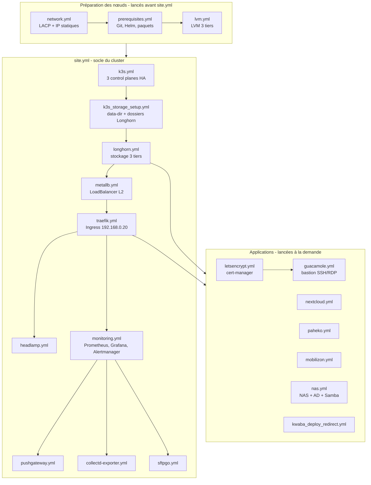

# Playbooks Ansible

Chaque playbook déploie une brique du cluster. `site.yml` enchaîne le socle (k3s, stockage,
réseau, ingress, monitoring). Les applications se lancent à part, une par une.

Il n'y a pas de rôles : les playbooks appliquent directement des charts Helm
(`charts/`) ou des manifests Kubernetes (par exemple `guacamole/`).

## Comment ça fonctionne



Les phases réseau, prérequis et LVM sont commentées dans `site.yml` : elles se lancent
directement (`ansible-playbook playbooks/network.yml`, etc.) avant le reste.

## Lancer un playbook

```bash
# Un playbook seul
ansible-playbook playbooks/traefik.yml -K

# Le socle complet, ou une phase
ansible-playbook playbooks/site.yml -K
ansible-playbook playbooks/site.yml -K --tags metallb

# Sur le nœud lui-même, sans SSH
ansible-playbook playbooks/guacamole.yml -K --connection=local
```

Tags de `site.yml` : `k3s`, `storage`, `longhorn`, `metallb`, `traefik`, `headlamp`,
`monitoring`, `pushgateway`, `collectd`, `sftpgo`.

## Liste des playbooks

### Préparation des nœuds

| Playbook | Rôle |
|---|---|
| `network.yml` | Réseau : LACP et IP statiques |
| `prerequisites.yml` | Prérequis système, Git, Helm |
| `lvm.yml` | LVM : 3 tiers de stockage (ultra, fast, slow) |
| `requirements.yml` | Collections Ansible Galaxy requises |

### Socle du cluster (`site.yml`)

| Playbook | Rôle |
|---|---|
| `k3s.yml` | K3s en HA, 3 control planes |
| `k3s_storage_setup.yml` | Migration du data-dir K3s et préparation de Longhorn |
| `longhorn.yml` | Stockage distribué Longhorn, 3 tiers |
| `metallb.yml` | Load balancer Layer 2 |
| `traefik.yml` | Ingress controller, IP fixe, domaine `*.app.corp.lcl` |
| `headlamp.yml` | Dashboard Kubernetes |
| `monitoring.yml` | Prometheus, Grafana, Alertmanager |
| `pushgateway.yml` | Pushgateway et dashboard du benchmark Wi-Fi (bornes kwaba-wifi) |
| `collectd-exporter.yml` | Métriques des bornes kwaba-wifi |
| `sftpgo.yml` | SFTPGo : sauvegardes des bornes kwaba-wifi |

### Applications

| Playbook | Rôle | Documentation |
|---|---|---|
| `guacamole.yml` | Apache Guacamole : bastion HTTPS SSH/RDP avec AD, TOTP et enregistrement | [`guacamole/README.md`](../guacamole/README.md) |
| `prestashop.yml` | PrestaShop : boutique e-commerce Barista (Helm) | [`charts/prestashop/README.md`](../charts/prestashop/README.md) |
| `letsencrypt.yml` | cert-manager et Let's Encrypt | |
| `nextcloud.yml` | Nextcloud, cloud personnel | |
| `paheko.yml` | Paheko, comptabilité associative | |
| `mobilizon.yml` | Mobilizon, événements fédérés | |
| `nas.yml` | NAS hybride avec Active Directory et Samba | |
| `monitoring-hardware.yml` | Sondes matérielles (capteurs et SMART) du Dell T5600 | |
| `kwaba_deploy_redirect.yml` | Redirection du site Kwaba Kinésiologie | |

### Maintenance

| Playbook | Rôle |
|---|---|
| `longhorn-upgrade.yml` | Mise à jour séquentielle de Longhorn (appelle `longhorn-upgrade-step.yml`) |
| `fix-dns.yml` | Correctif de la limite de serveurs DNS dans les pods |
| `ssd_maintenance.yml` | Diagnostic et maintenance des SSD |
| `storage_benchmark.yml` | Benchmark du stockage multi-tiers |
| `shutdown_nodes.yml` | Arrêt forcé des nœuds |

## Conseils

- Le playbook Guacamole exécute ses tâches `kubectl` sur `k3s-node-1` avec
  `KUBECONFIG=/etc/rancher/k3s/k3s.yaml`.
- `-K` demande le mot de passe sudo. Ajoute `-k` si la connexion SSH se fait par mot de passe.
- `kubectl apply` et le module `kubernetes.core.k8s` ajoutent et modifient des champs mais ne
  retirent pas ceux qui ont été supprimés d'un manifest. Pour retirer un champ, utilise
  `kubectl patch` ou recrée l'objet.
